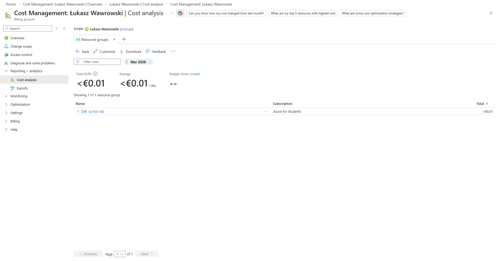

# Azure Data Lake

Celem zajęć jest zapoznanie się z pracą na danych przechowywanych w chmurze zamiast lokalnych plików.

## Wprowadzenie

Do tej pory pracowaliśmy na danych lokalnie:

```
data/yellow_tripdata_2025-01.parquet
```

W rzeczywistych systemach dane są przechowywane w chmurze:

- Azure Data Lake
- AWS S3
- Google Cloud Storage

## Co to jest Data Lake?

Data Lake to:

- miejsce przechowywania danych w różnych formatach (np. parquet, csv)
- brak sztywnego schematu (schema-on-read)
- możliwość pracy na dużych wolumenach danych

Możliwa struktura Data Lake

```

container/
├── raw/      # dane surowe
├── silver/   # dane przetworzone
└── gold/     # dane do analizy / dashboardów

```

## Tworzenie Storage Account

1. Wejdź na stronę https://portal.azure.com i zaloguj się na swoje konto.
2. Utworzenie zasobu - wyszukaj `Storage accounts` i kliknij `Create`.
3. Konfiguracja

- **Resource group**: `rg-taxi-lab` (lub utwórz nową)
- **Storage account name**: unikalna nazwa (np. `taxilake12345`)
- **Region**: Europe (np. Europe Poland Central)
- **Preferred storage type**: Azure Blob Storage 

4. W zakładce `Advanced` włącz opcję `Enable hierarchical namespace`
5. Utworzenie Data Lake: Kliknij `Review + Create → Create` i poczekaj aż zasób zostanie utworzony.

## Tworzenie kontenera i upload danych

1. Przejdź do kontenerów w Storage Account - `Data storage → Containers`.
2. Utwórz kontener - kliknij: `Container` i podaj nazwę np. `taxi-data`.
3. Utwórz strukturę folderów - wejdź do kontenera i utwórz foldery:

```
raw/
silver/
gold/
```

4. Wgraj dane - wejdź do folderu `raw` i kliknij `upload`. Następnie wgraj plik `yellow_tripdata_2025-01.parquet`

## Dostęp do danych (Access Key)

1. W Storage Account przejdź do `Security + networking → Access keys`
2. Skopiuj klucz `key1`.

## Python – odczyt danych

W pierwszym kroku potrzebujemy mieć zainstalowane następujące biblioteki:

```bash
pip install pandas pyarrow fsspec adlfs
```

Następnie możemy uruchomić kod:

```python
import pandas as pd

account_name = "TWOJA_NAZWA_STORAGE"
account_key = "TWOJ_KLUCZ"

file_path = f"abfs://taxi-data@{account_name}.dfs.core.windows.net/raw/yellow_tripdata_2025-01.parquet"

df = pd.read_parquet(
    file_path,
    storage_options={
        "account_name": account_name,
        "account_key": account_key
    }
)

df.head()
```

## Podstawowa analiza danych

Wykonaj poniższe operacje:

```python
# liczba rekordów
df.shape

# średni dystans
df["trip_distance"].mean()

# najpopularniejsze godziny
df["tpep_pickup_datetime"] = pd.to_datetime(df["tpep_pickup_datetime"])
df["hour"] = df["tpep_pickup_datetime"].dt.hour

df["hour"].value_counts().head()
```

### Zadanie

Przetwórz dane i zapisz je w strefie `silver`.

1. Wczytaj dane z `raw`
2. Usuń rekordy gdzie `trip_distance <= 0`
3. Zapisz dane do `silver/cleaned.parquet`

### Zadanie

1. Oblicz średnią długość przejazdu na godzinę
2. Zapisz wynik do `gold/hour_aggregated.parquet`

## Dostęp do danych (SAS token)

Access Key:

- daje pełny dostęp do całego konta
- jest niebezpieczny w projektach

SAS (Shared Access Signature):

- daje ograniczony dostęp
- może wygasnąć
- może mieć tylko read/write

Tworzenie SAS token:

1. W Azure przejdź do `Storage Account → Containers → taxilake12345`
2. Następnie `Security + networking → Shared access signature`
3. Zaznacz niezbędne uprawnienia i określ czas ważności
4. Wygeneruj token

Wczytanie danych z SAS token w python:

```python
import pandas as pd

account_name = "TWOJA_NAZWA_STORAGE"
sas_token = "TWOJ_SAS_TOKEN"

file_path = f"abfs://taxi-data@{account_name}.dfs.core.windows.net/raw/yellow_tripdata_2025-01.parquet"

df = pd.read_parquet(
    file_path,
    storage_options={
        "account_name": account_name,
        "sas_token": account_key
    }
)

df.head()
```

### Zadanie

Co się stanie jeśli spróbujemy zapisać plik z wykorzystaniem SAS token bez wymaganych uprawnień?

## Zarządzenie plikami z poziomu kodu

Usuwanie plików

```python
from adlfs import AzureBlobFileSystem

account_name = "TWOJA_NAZWA"
account_key = "TWOJ_KEY"

fs = AzureBlobFileSystem(
    account_name=account_name,
    account_key=account_key
)

# ścieżka: container + path
file_path = "taxi-data/silver/cleaned.parquet"

fs.rm(file_path)

print("Plik usunięty")
```

Usuwanie folderu

```python
fs.rm("taxi-data/silver", recursive=True)
```

Sprawdzanie co jest w folderze

```python
fs.ls("taxi-data/raw")
```

### Zadanie

Stwórz katalog `archive` i przenieś tam plik `silver/cleaned.parquet`.

## Analiza kosztów

W Azure płacimy za:

1. Przechowywanie danych (GB / miesiąc)
2. Operacje (read / write)
3. Transfer danych (egress)



- Parquet = mniej danych = niższe koszty
- wiele małych operacji = drożej
- Data Lake jest generalnie tani, ale nie „za darmo”

Rozwiązania self-hosted: MinIO, Ceph, HDFS.