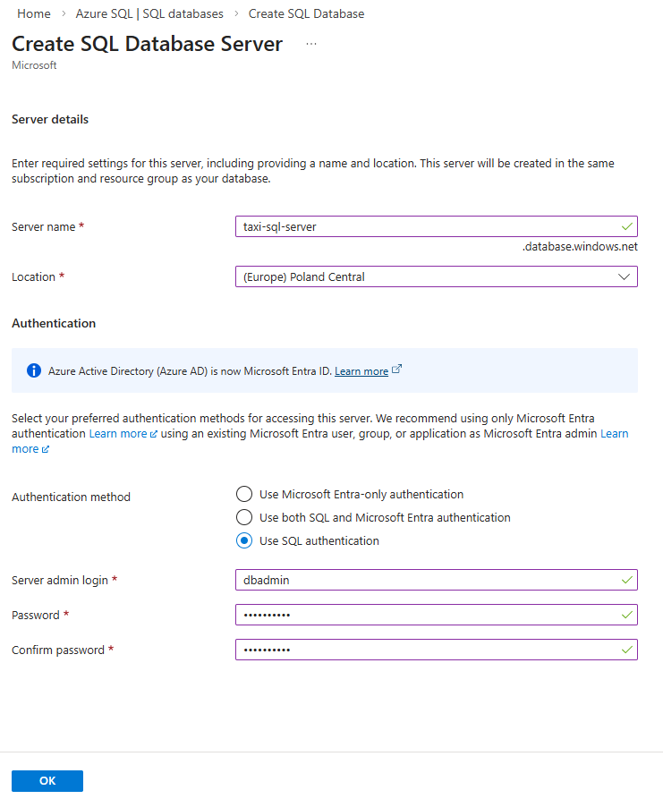
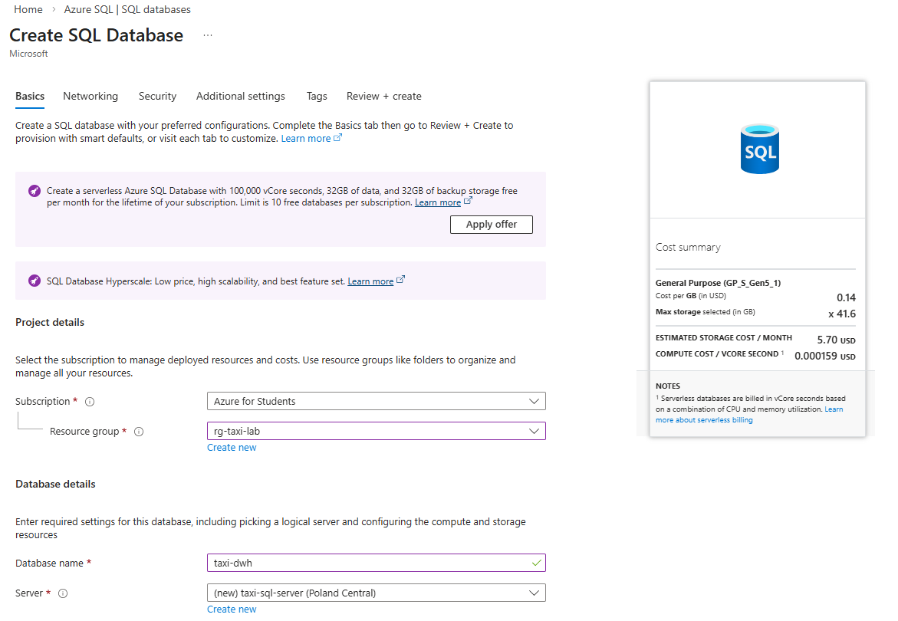
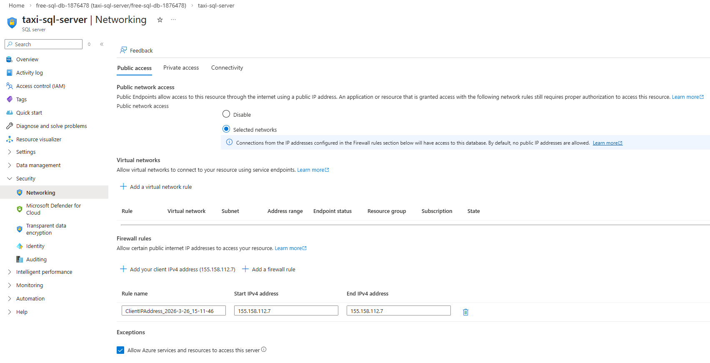

# Azure SQL

## Schemat gwiazdy w hurtowniach danych

Schemat gwiazdy (ang. *Star Schema*) jest jednym z najczęściej stosowanych modeli logicznych w projektowaniu hurtowni danych. Jego nazwa pochodzi od charakterystycznego układu tabel, w którym centralnie znajduje się tabela faktów, a wokół niej rozmieszczone są tabele wymiarów, przypominające swoim układem gwiazdę.

Schemat gwiazdy został opracowany w celu ułatwienia analizy dużych zbiorów danych oraz usprawnienia wykonywania zapytań analitycznych. Jest szczególnie popularny w systemach wspomagania decyzji (DSS – Decision Support Systems) oraz w narzędziach Business Intelligence (BI), gdzie istotna jest szybka analiza danych historycznych oraz generowanie raportów.

Schemat gwiazdy składa się z dwóch podstawowych elementów:

**Tabela faktów** – jest centralnym elementem schematu. Zawiera dane liczbowe (miary), które podlegają analizie, takie jak:

* wartość sprzedaży,
* liczba sprzedanych produktów,
* przychody,
* koszty.

Tabela faktów zawiera również klucze obce odnoszące się do tabel wymiarów.

**Tabele wymiarów** – otaczają tabelę faktów i zawierają dane opisowe, które umożliwiają analizę faktów według różnych kryteriów. Przykładowe wymiary to:

* czas (np. dzień, miesiąc, rok),
* produkt (np. nazwa produktu, kategoria),
* klient (np. wiek, lokalizacja),
* lokalizacja (np. miasto, region, kraj).

Tabele wymiarów są zazwyczaj zdenormalizowane, co oznacza, że zawierają więcej danych opisowych w jednej tabeli, aby przyspieszyć zapytania.

Do głównych zalet schematu gwiazdy należą:

* prostota struktury i łatwość zrozumienia,
* szybkie wykonywanie zapytań analitycznych,
* dobra wydajność przy dużych zbiorach danych,
* łatwość integracji z narzędziami analitycznymi i raportowymi.

## Zadanie

Pobierz dane z Azure Data Lake z folderu `silver/cleaned.parquet` i przygotuj trzy tabele zawierające następujące kolumny:

- `dim_time`: time_id, tpep_pickup_datetime, hour, weekday, month, year, is_weekend
- `dim_vendor`: vendor_id, vendor_name
- `fact_trips`: time_id, vendor_id, trip_distance, fare_amount, total_amount, trip_duration

## Baza danych SQL w Azure

1. Na Azure Portal: `Create Resource → SQL Database`
2. Do wyboru opcja free lub płatna - w wersji free nie możemy wybrać nazwy bazy danych
3. Tworzymy SQL Database Server

  

4. Tworzymy SQL Database



5. Networking



## SQLAlchemy

Do ładowania danych do bazy danych w środowisku Azure wykorzystana zostanie biblioteka SQLAlchemy, która stanowi popularne narzędzie w języku Python służące do komunikacji z relacyjnymi bazami danych. SQLAlchemy umożliwia wykonywanie operacji na bazach danych w sposób bardziej elastyczny i niezależny od konkretnego systemu zarządzania bazą danych.

Biblioteka SQLAlchemy działa jako warstwa pośrednia pomiędzy aplikacją a bazą danych, pozwalając na tworzenie zapytań SQL przy użyciu składni języka Python. Umożliwia zarówno wykonywanie zapytań SQL bezpośrednio, jak i korzystanie z mechanizmu ORM (Object-Relational Mapping), który pozwala odwzorować tabele bazy danych na obiekty w programie.

Instalacja: `pip install sqlalchemy pyodbc`

Połączenie z bazą danych

```python
from sqlalchemy import create_engine

server = "twoj-serwer.database.windows.net"
database = "taxi-dwh"
username = "sqladmin"
password = "HASLO"

connection_string = (
    f"mssql+pyodbc://{username}:{password}"
    f"@{server}:1433/{database}"
    "?driver=ODBC+Driver+18+for+SQL+Server"
)

engine = create_engine(connection_string)
```

lub

```python
from sqlalchemy import create_engine
import urllib

params = urllib.parse.quote_plus(
    "Driver={ODBC Driver 18 for SQL Server};"
    "Server=taxi-serwer.database.windows.net;"
    "Database=taxi-dwh;"
    "Uid=sqladmin;"
    "Pwd=HASLO;"
    "Encrypt=yes;"
    "TrustServerCertificate=no;"
    "Connection Timeout=30;"
)

engine = create_engine(
    f"mssql+pyodbc:///?odbc_connect={params}"
)
```

Może być konieczne zainstalowanie sterowników [ODBC Driver 18 for SQL Server](https://learn.microsoft.com/pl-pl/sql/connect/odbc/download-odbc-driver-for-sql-server?view=sql-server-ver17). To czy są zainstalowane można sprawdzić z wykorzystaniem poniższego kodu:

```python
import pyodbc

print(pyodbc.drivers())
```

### Tworzenie tabel z DataFrame

```python
dim_time.to_sql(
    "dim_time",
    engine,
    if_exists="replace",
    index=False
)

dim_vendor.to_sql(
    "dim_vendor",
    engine,
    if_exists="replace",
    index=False
)

fact_trips.to_sql(
    "fact_trips",
    engine,
    if_exists="replace",
    index=False
)
```

### Definicja tabel w SQLAlchemy

```python
from sqlalchemy import (
    Column,
    Integer,
    Float,
    DateTime,
    ForeignKey,
    String
)

from sqlalchemy.orm import declarative_base

Base = declarative_base()


class DimTime(Base):

    __tablename__ = "dim_time"

    time_id = Column(Integer, primary_key=True)

    pickup_datetime = Column(DateTime)

    hour = Column(Integer)
    weekday = Column(Integer)
    month = Column(Integer)
    year = Column(Integer)
```

Tabela faktów

```python
class FactTrips(Base):

    __tablename__ = "fact_trips"

    trip_id = Column(Integer, primary_key=True)

    time_id = Column(
        Integer,
        ForeignKey("dim_time.time_id")
    )

    vendor_id = Column(
        Integer,
        ForeignKey("dim_vendor.vendor_id")
    )

    trip_distance = Column(Float)

    fare_amount = Column(Float)

    total_amount = Column(Float)
```

Tworzenie tabel

```python
Base.metadata.create_all(engine)
```

## Zapytania analityczne

Sprawdzenie czy dane są w bazie

```python
query = "SELECT COUNT(*) FROM fact_trips"

pd.read_sql(query, engine)
```

Średnia cena wg godziny 

```python
query = """
SELECT
    t.hour,
    AVG(f.fare_amount) AS avg_fare
FROM fact_trips f
JOIN dim_time t
    ON f.time_id = t.time_id
GROUP BY t.hour
ORDER BY t.hour
"""

result = pd.read_sql(query, engine)

result.head()
```

### Zadania

Znajdź

1. godzinę z największą liczbą kursów
2. średnią odległość wg dnia tygodnia
3. vendor z największym przychodem

Zapoznaj się z odpowiednimi funkcjami z biblioteki SQLAlchemy i przekonwertuj powyższe zapytania na czysty python.