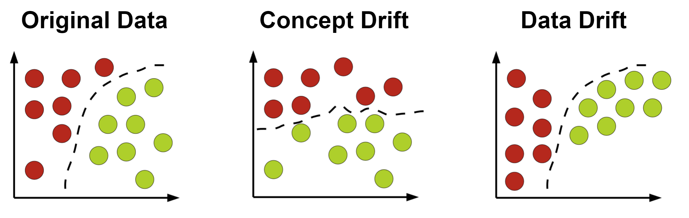

# Monitoring modeli ML

Podczas poprzednich zajęć modele uczenia maszynowego były:

* trenowane,
* wersjonowane,
* orkiestrwane,
* serwowane przez API.

W praktycznych systemach wdrożenie modelu nie kończy jednak procesu pracy z modelem. Jednym z najważniejszych problemów współczesnych systemów ML jest utrzymanie jakości modelu po wdrożeniu do środowiska produkcyjnego. Model, który osiąga wysoką jakość podczas trenowania, może z czasem zacząć generować coraz gorsze predykcje. Przyczyną tego zjawiska są zmiany zachodzące w danych wejściowych, zachowaniu użytkowników lub środowisku biznesowym. Dlatego nowoczesne systemy ML wymagają monitorowania modeli podobnie jak monitoruje się klasyczne systemy informatyczne.

Modele ML działają na danych pochodzących z rzeczywistego świata. Dane te zmieniają się w czasie, a wraz z nimi zmienia się rozkład cech wejściowych oraz zależności między danymi a zmienną docelową.

Przykłady:

* model przewidujący ceny mieszkań może przestać działać poprawnie po zmianie sytuacji gospodarczej,
* model wykrywania fraudów może być omijany przez nowe typy ataków,
* system rekomendacyjny może tracić skuteczność wraz ze zmianą preferencji użytkowników.

W przeciwieństwie do klasycznego oprogramowania model ML może pogarszać swoje działanie mimo braku zmian w kodzie aplikacji.

## Cele monitoringu modeli

Monitoring modeli ML ma kilka podstawowych celów:

1. Wykrywanie spadku jakości modelu - system powinien wykrywać sytuacje, w których model zaczyna generować gorsze predykcje.
2. Wykrywanie zmian w danych wejściowych - zmiana rozkładu danych może oznaczać, że model działa na danych innych niż te używane podczas treningu.
3. Monitorowanie wydajności systemu - w środowisku produkcyjnym istotne są również: czas odpowiedzi API, liczba zapytań, zużycie zasobów.

## Najważniejsze problemy monitorowane w ML

### Data Drift

Data drift oznacza zmianę rozkładu danych wejściowych względem danych treningowych.

Przykład:

Model cen mieszkań został wytrenowany na danych sprzed kilku lat. Obecnie średnie ceny mieszkań są znacznie wyższe niż podczas treningu.

### Concept Drift

Concept drift oznacza zmianę zależności pomiędzy cechami wejściowymi a zmienną docelową.

Przykład:

Relacja pomiędzy lokalizacją mieszkania a jego ceną może zmieniać się wraz z rozwojem infrastruktury miasta.

### Prediction Drift

Prediction drift oznacza zmianę rozkładu samych predykcji modelu.

Przykład:

Model zaczyna przewidywać coraz wyższe ceny dla wszystkich mieszkań.



### Metody wykrywania Driftu

Model ML zakłada, że dane produkcyjne pochodzą z podobnego rozkładu statystycznego jak dane używane podczas treningu. Gdy założenie to przestaje być prawdziwe, jakość modelu może zacząć się pogarszać. W praktyce monitoring driftu sprowadza się do porównywania dwóch zbiorów danych:

- zbioru referencyjnego (reference data),
- zbioru aktualnego (current data).

Celem analizy jest odpowiedź na pytanie: czy dane produkcyjne różnią się statystycznie od danych treningowych?

W praktyce najczęściej stosowane są następujące metody:

- test Kolmogorova–Smirnova - porównanie rozkładów danych referencyjnych i aktualnych.
- Wasserstein distance - odległość pomiędzy dwoma rozkładami.
- Population Stability Index (PSI) - porównanie odsetka obserwacji w przedziałach danych referencyjnych i aktualnych.
- Jensen–Shannon Divergence - mierzy podobieństwo pomiędzy dwoma rozkładami prawdopodobieństwa.
- Kullback–Leibler Divergence - mierzy odległości pomiędzy dwoma rozkładami prawdopodobieństwa.
- test $\chi^2$ - porównanie częstości dla danych kategorycznych.

W praktyce nie istnieje jeden idealny test - każda metoda ma ograniczenia. W związku z tym do monitoringu modeli zwykle wykorzystuje się kilka metod jednocześnie.

### Narzędzia

Istnieje wiele różnych bibliotek do wykrywania zmian w danych i monitoringu modelu:

- [Evidently](https://www.evidentlyai.com/)
- [frouros](https://github.com/IFCA-Advanced-Computing/frouros)
- [deepchecks](https://docs.deepchecks.com/0.13/getting-started/welcome.html)

Podczas zajęć wykorzystamy Evidently, więc zainstaluj:

```bash
pip install evidently scikit-learn pandas matplotlib
```

## Case study - data drfit

Podczas laboratorium wykorzystane zostaną dwa zbiory danych.

1. California Housing do do regresji cen mieszkań.

2. Wine Quality do pokazania problemu driftu jakości danych w klasyfikacji.

### California Housing

Przygotowujemy dane

```python
import pandas as pd

from sklearn.datasets import fetch_california_housing
from sklearn.model_selection import train_test_split

data = fetch_california_housing()

X = pd.DataFrame(
    data.data,
    columns=data.feature_names
)

y = data.target

X_train, X_ref, y_train, y_ref = train_test_split(
    X,
    y,
    test_size=0.3,
    random_state=42
)
```

W tym miejscu możemy po raz pierwszy zapoznać się z biblioteką evidently, generując podsumowanie danych:

```python
from evidently import Report
from evidently.metrics import *
from evidently.presets import *

report = Report([
    DataSummaryPreset(),
], include_tests=True)

my_eval = report.run(X_ref, None)

my_eval.save_html(
    "housing_summary_report.html"
)
```

Następnie trenujemy model

```python
from sklearn.ensemble import RandomForestRegressor
from sklearn.metrics import mean_absolute_error

model = RandomForestRegressor(
    random_state=42
)

model.fit(
    X_train,
    y_train
)

reference_predictions = model.predict(
    X_ref
)

print(mean_absolute_error(
    y_ref, reference_predictions))
```

W kolejnym kroku Wprowadzimy sztuczny drift. W celu symulacji problemu produkcyjnego, zmodyfikujemy dane wejściowe.

```python
X_drifted = X_ref.copy()

X_drifted["MedInc"] *= 2
X_drifted["AveRooms"] *= 1.5
```

#### Zadanie

Za pomocą funkcji `describe()` porównaj rozkłady obu zbiorów. Czy jest widoczna różnica?

### Generowanie raportu driftu

```python
report = Report([
    DataDriftPreset()
])

my_report = report.run(
    reference_data=X_ref,
    current_data=X_drifted
)

my_report.save_html(
    "housing_drift_report.html"
)
```

Na stronie [https://docs.evidentlyai.com/metrics/customize_data_drift](https://docs.evidentlyai.com/metrics/customize_data_drift) dostęne są informacje na temat dodatkowych opcji klasy `Report`.

### Wine Quality

Sprawdzimy jak będzie to wyglądało dla problemu klasyfikacji.

```python
from sklearn.datasets import load_wine

wine_data = load_wine(as_frame=True)

X_wine = wine_data.data
y_wine = wine_data.target
```

#### Zadanie

Wygeneruj drift danych `X_wine_drifted["alcohol"] *= 1.8` i wygeneruj raport. Jakie elementy się zmieniły najbardziej?

## Case study - prediction drift

O ile do wykrywania data driftu wystarczyło podać zbiory danych, tak w przypadku analizy predykcji musimy przygotować obiekt odpowiedniej klasy. 

```python
from evidently import Dataset, Regression, DataDefinition

drifted_predictions = model.predict(
    X_drifted
)

reg_definition = DataDefinition(
    regression=[Regression(target="y_true", prediction="y_pred")]
    )

ref_df = X_ref.copy()
ref_df["y_true"] = y_ref
ref_df["y_pred"] = reference_predictions

ref_data = Dataset.from_pandas(
    ref_df,
    data_definition=reg_definition
)

drifted_df = X_drifted.copy()
drifted_df["y_true"] = y_ref
drifted_df["y_pred"] = drifted_predictions

drifted_data = Dataset.from_pandas(
    drifted_df,
    data_definition=reg_definition
)
```

A następnie wygenerować odpowiedni raport.

```python 
report = Report([
    RegressionPreset()
], include_tests=True)

my_report = report.run(
    current_data=drifted_data, reference_data=ref_data
)

my_report.save_html(
    "prediction_drift_report.html"
)

```

W środowisku produkcyjnym raporty HTML generowane przez Evidently będą zwykle niewystarczające. Są bardzo dobre do analizy eksperymentalnej i debugowania, ale w realnych systemach monitoring powinien działać automatycznie i zwracać ustrukturyzowane informacje, które mogą zostać wykorzystane przez pipeline’y retrainingu czy systemy observability. Każdy wygenerowany raport można przekonwertować do słownika i na tej podstawie napisać funkcje, które będą ekstrachowały odpowiednie informacje i przekazywały np. przez API. Przykładowy wynik działania takiej funkcji może być następujący:

```json
{
    "drift": {
        "drift_detected": True,
        "drift_share": 0.75
    },
    "quality": {
        "mse": 1.84,
        "quality_degraded": True
    }
}
```

Na tej podstawie mogą być zdefiniowane określone alerty lub automatyczny retrening modelu. Zawsze jednak należy zwrócić także uwagę na aspekty biznesowe modelu.

#### Zadanie

Przygotuj raport prediction drift dla zadania klasyfikacji. Spróbuj zmodyfikować dane tak, aby model zaczął przewidywać niemal wyłącznie jedną klasę.

## Podsumowanie

Monitoring modeli ML jest jednym z najważniejszych elementów współczesnych systemów MLOps, ponieważ jakość modeli może pogarszać się w czasie mimo braku zmian w kodzie aplikacji. Przyczyną są zmiany danych wejściowych oraz zmieniające się zależności biznesowe. W praktyce monitorowane są trzy główne zjawiska: data drift, prediction drift oraz concept drift.

Monitoring modeli ma jednak znaczenie nie tylko dla utrzymania jakości predykcji, ale również dla bezpieczeństwa systemów sztucznej inteligencji. Coraz większym problemem są adversarial attacks, czyli celowe manipulowanie danymi wejściowymi w taki sposób, aby model generował błędne predykcje. Ataki tego typu szczególnie często dotyczą modeli deep learning oraz danych wysokowymiarowych, takich jak obrazy, tekst, dźwięk czy embeddingi modeli językowych. Niewielkie, często niezauważalne dla człowieka zmiany danych mogą prowadzić do całkowicie błędnych decyzji modelu.

Problemy te mają największe znaczenie w systemach krytycznych, takich jak autonomiczne pojazdy, biometria, systemy bezpieczeństwa, analiza medyczna czy wykrywanie fraudów finansowych. W takich zastosowaniach monitoring driftu i predykcji może pełnić rolę mechanizmu wczesnego ostrzegania przed próbami manipulacji systemem ML. Z tego powodu nowoczesny monitoring modeli coraz częściej łączy analizę jakości modeli, wykrywanie driftu oraz mechanizmy cyberbezpieczeństwa w ramach jednego ekosystemu MLOps.